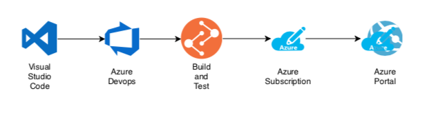
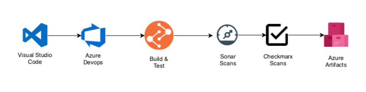
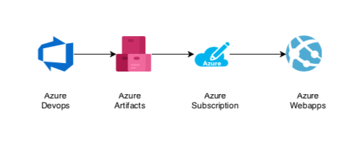

# cicd-si7-approach
proposed approach for cicd pipelines

## Current CICD Pipeline

Currently we have clubbed our Continuous Integration and Delivery pipeline as one 
component where we are checking out the code from VSTS followed by Build, testing and 
deploying on Azure in a single step:

## Future proposal

* Break CI & CD as 2 separate pipelines

* Introduce following quality gates
    * Unit testing
    * Sonar Scans
    * Checkmarx validation 

* Publish artifacts to Azure Artifacts

* Build webhooks for Pull request integration

* Enable LGTM(Looks good to me) for pull request merges.

* Build multi branch pipeline as code so that we don't have to replicate build configurations 
manually on different branches.

## Proposed CI Builds:

Here are the enhancements proposed to the future CI: 

 
 
 * Include SONAR scans for code coverage
 * Include Checkmarks scan to check for any security vulnerabilities.
 * Uploading the versions artifacts to Azure Artifacts.
 * Benefits of azure artifacts:
    * Different version of releases can be stored and referenced.
    * Teams can build smaller units of code locally instead of copy entire monolith locally.
    * packaging can lead us towards containerization path in future.
 
 
 ## Proposed CD Builds
 
 Here are the enhancements proposed to the future CD: 
 
 * Extract versioned artifacts from Azure repository
 * Push the version to Azure Portal.

 
 
